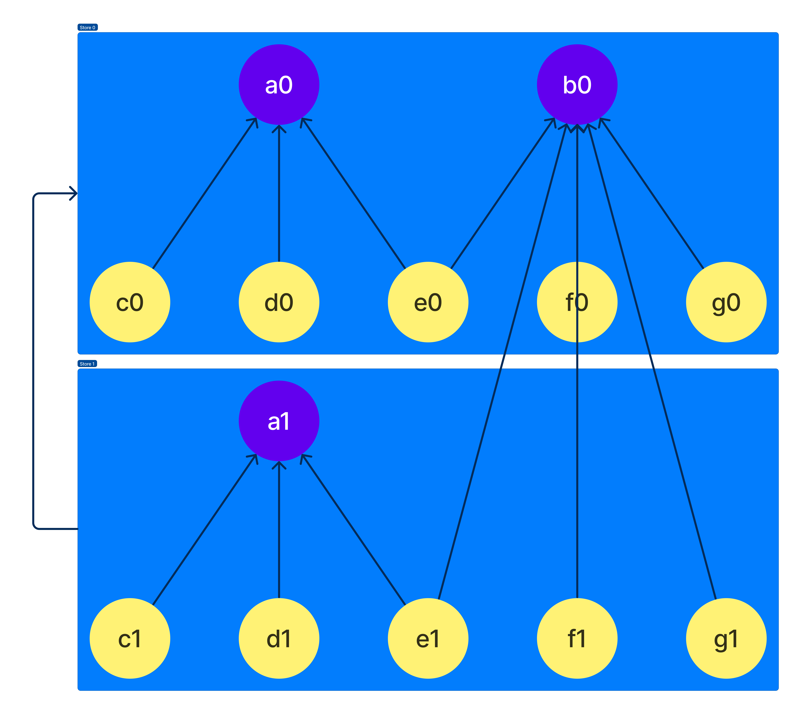

In **state_watcher**, a store contains the actual states referenced by [Provided][provided] or [Computed][computed] (also called, as a generic term, Refs).

:::note
In the rest of the documentation we will often shorten *The state referenced by this Provided* by *The state of the Provided*.
:::

Let's take the following example: We have two `Provided` **a** and **b**, and 5 `Computed` named **c** through **g**. The `Computed` **c**, **d**, and **e** depend on the state of the `Provided` **a**. The `Computed` **e**, **f**, and **g** depend on the states of the `Provided` **b**.
Let's say all their states are stored in the store number 0.

In the illustration below, representing these relationships, the states are called with the name of their Ref followed by the id of the store (0 here). The states of the `Provided` are in purple and the states of the `Computed` are in yellow.


In **state_watcher** each store can have a parent store. This is useful if we want to override the value of a `Provided` by something else.
For example, let's say we have a store 1 depending on the store 0 and in this store we override the `Provided` **a**. In this case we can representing the relations by the image below:



As you can see, now we have another state for the `Provided` **a** in the store number 1 (a1), and all the `Computed` have also another state in the store 1. This is because otherwise the location of the state of a `Computed` could change over time and it would be too complicated to handle it.
But since Refs are lazily created, **f1** and **g1** would not be created before we want to evaluate them.

:::tip[Rules]
To know where the state of a Ref will be stored, there are two simple rules:
- The state of a `Provided` will always be created in the nearest store where it's overriden, otherwise it will be created on the root one.
- The state of a `Computed` is always created in the nearest store.
:::

A concrete use case for overriding a [Provided][provided] is when you have a list of elements, and you want to represent under the same `Provided`, the element for its subtree.


## Flutter Widget

To create a store in Flutter, we just have to insert a `StateStore` widget in our tree. Typically we'll add one at the root of our app in order to store in it our common states between our screens.

```dart
StateStore(
  child: MyWidget(),
);
```

If you want to override some `Provided` in a `StateStore`, you have a `overrides` set for that:
```dart
StateStore(
  overrides: {
    a.overrideWithValue(10),
  },
  child: MyWidget(),
);
```

<!-- Links -->
[provided]: /state_watcher/reference/provided
[computed]: /state_watcher/reference/computed
