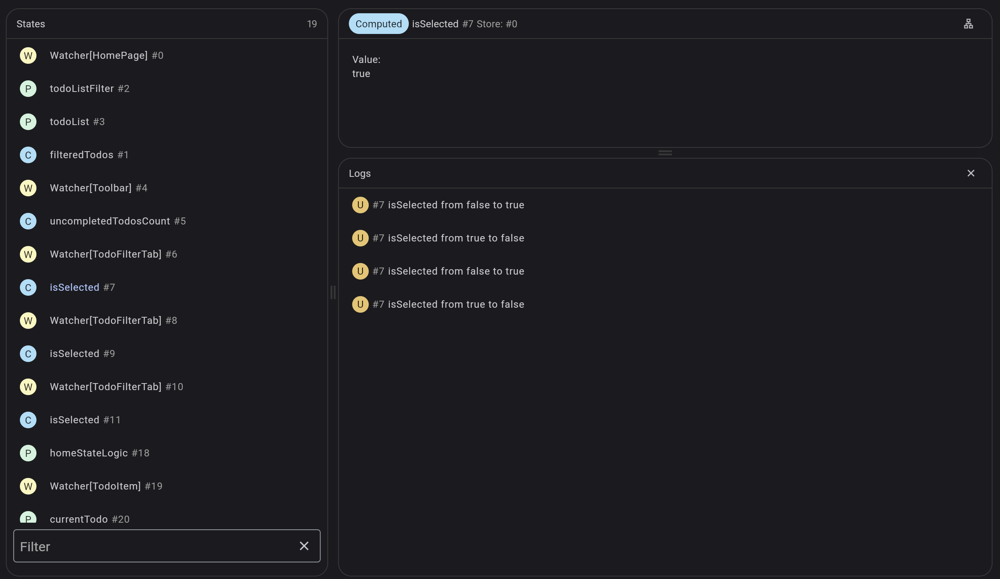
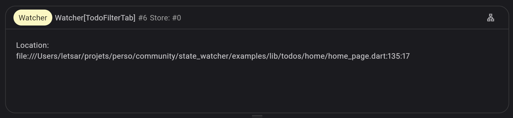

You can easily see what's going on under the hood thanks to DevTools.

In debug mode, launch the DevTools and look for the state_watcher extension tab.

By clicking on it, you will display the **state_watcher** dashboard:

On the left panel, you'll find the active refs across all the stores in your app. It's possible to filter on the ref's debugName.

On the bottom-right panel, you'll find the log panel which displays the creation, updates and deletion of the states. When selecting a ref, only the logs about the selected ref are shown.

On the top-right panel, you'll find the details about the selected ref on the left panel.

You'll find here some live information about the value stored by the ref, or in case of a Watcher you'll be able to get its location in your code:

Thanks to that it will be easier to see which widget in your code is being rebuilt.

By clicking on the **Track dependencies** button on the top-right of the details panel, you will be able to have the logs of all the dependencies of the currently selected ref. It will be easier to track the flow of the data by having all the updates of the data hierarchy.

